# 环境监测装置

## **一、实验目的和要求**

1.实验目的

掌握嵌入式驱动程序开发方法，`uCOS-II`应用程序开发方法，利用`ARM-MDK`开发工具进行软硬件联合调试方法；了解嵌入式软件架构设计方法与实现步骤；提升复杂工程设计能力。

2.实验要求

基于`STM32F4`开发板设计一款温度、光线强度等环境参数采集并LCD显示的设备，该设备可根据环境参数及上位机通过串口下发的指令输出PWM控制信号，并控制LCD显示，具体要求如下。

Ø MCU驱动程序利用芯片内部温度及外部光敏传感器获取环境参数（温度、光线强度），持续性获取的原始参数值可通过滤波算法进行处理，防止数据异常抖动；

Ø MCU将环境参数输出到LCD显示屏进行显示；

Ø MCU接收上位机的串口数据并进行解析，上位机下发的命令至少包括——LCD显示开关命令、PWM输出开关命令；

Ø 设计`PWM`控制策略，可根据当前环境参数调整PWM占空比，环境参数与PWM占空比对应关系可自行设计，在实验报告中阐述；

Ø `MCU`程序基于`uCOS-II`操作系统设计，并完成测试，撰写实验报告。

## **二、实验设备**

硬件：ALIENTEK探索者STM32F4开发板、ST-Link调试器、PC机、串口连接线。

软件：PC 机Windows操作系统、ARM MDK5集成开发环境、仿真器驱动程序、超级终端通讯程序。

## **三、实验方案**

本系统以STM32F4开发板为核心，采用模块化设计理念，包括数据采集、数据处理、LCD显示、PWM控制、串口通信、触摸控制及按键控制等模块。这些模块之间通过uCOS-II操作系统实现任务调度和通信，确保系统的高效稳定运行。软件系统流程图如下所示：

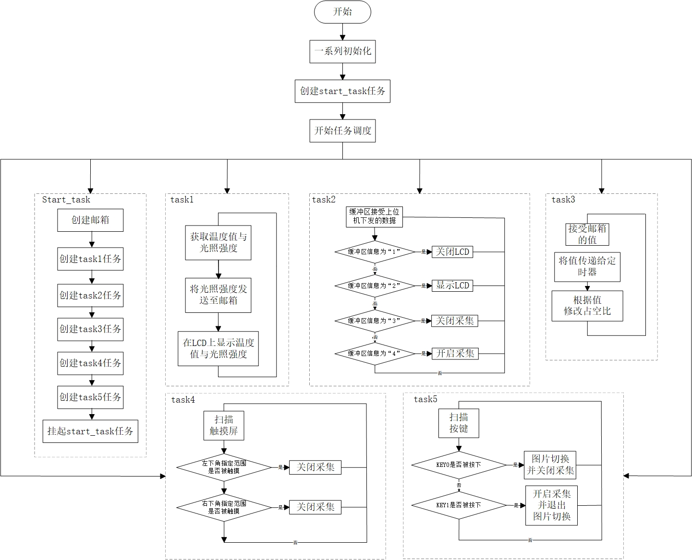

​												图1 软件系统流程图

数据采集模块利用STM32F4的内部温度传感器和外部光敏传感器，实时采集温度和光线强度数据。为提高数据采集的准确性和稳定性，模块采用滑动平均滤波算法对原始数据进行处理，有效消除噪声干扰。

LCD显示模块采用图形化界面设计，能够实时显示温度、光线强度等环境参数。模块还支持根据串口通信模块和触摸控制模块的指令进行开关控制。为提高用户体验，模块还设计了友好的交互界面和动画效果，使得信息的展示更加直观、生动。

PWM控制模块根据当前环境参数（特别是光照强度）动态调整PWM占空比，实现精确的控制效果。模块还支持根据串口通信模块的指令进行PWM输出的开关控制，方便用户根据实际需求进行灵活调整。

串口通信模块负责接收上位机发送的控制指令，如LCD显示开关命令、PWM输出开关命令等。模块设计了简洁明了的通信协议，确保指令的准确传输和解析。同时，模块还实现了与上位机的双向通信功能，能够实时上传设备状态和采集数据，方便用户对设备进行远程监控和管理。

触摸控制模块利用触摸屏实现触摸控制功能。模块设计了合理的触摸界面和响应机制，用户可以通过触摸屏幕实现开启采集、关闭采集等操作。同时，模块还通过触摸事件处理函数实现与LCD显示模块和PWM控制模块的交互，提升了系统的灵活性和易用性。

按键控制模块负责检测按键KEY0和KEY1的状态。模块设计了去抖算法和状态切换逻辑，确保按键控制的稳定性和准确性。根据按键状态的不同，模块会执行相应的操作，如图片显示、采集开启等，为用户提供了更多的操作选择。

## **四、实验内容**

1.任务划分与调度

在uCOS-II操作系统中创建多个任务，分别负责数据采集、数据处理、LCD显示、PWM控制、串口通信、触摸控制和按键控制等功能。

利用任务调度器实现任务的并发执行和通信，确保系统的高效运行。

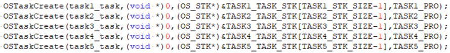

​									图2.Start_task任务代码部分截图

2.邮箱的使用

在uCOS-II操作系统中，使用start_task任务创建邮箱，使用task1发送邮箱，task3接受邮箱。

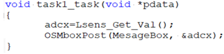

​										图3 task_1任务发送邮箱部分截图

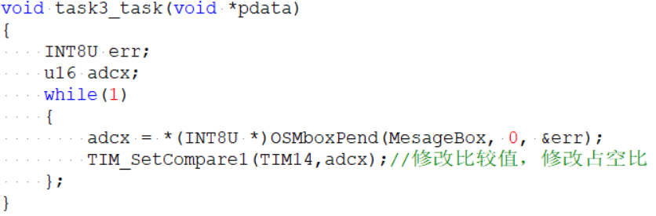

​									图4 task_3任务接受邮箱信息部分截图

3.驱动程序开发

编写STM32F4开发板的驱动程序，包括温度传感器驱动、光敏传感器驱动、LCD驱动、PWM驱动等。驱动程序需遵循模块化设计原则，便于维护和扩展。

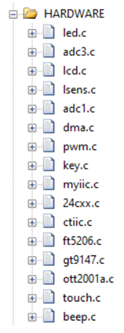

​											图5.驱动程序.c文件

4.界面设计

设计友好的LCD显示界面和触摸界面，包括环境参数显示区域、控制按钮等。

采用图形化设计工具进行界面设计，提高界面的美观性和易用性。

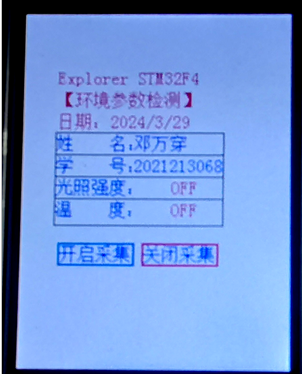

​											图6 LCD显示和触摸界面

5.系统测试与优化

对系统进行全面的测试，包括功能测试、性能测试和稳定性测试。

测试过程如下：

（1）   利用芯片内部温度及外部光敏传感器获取环境参数（温度、光线强度），并将环境参数输出到LCD显示屏进行显示；


​													图7 采集并显示功能

（2）MCU接收上位机的串口数据并进行解析；

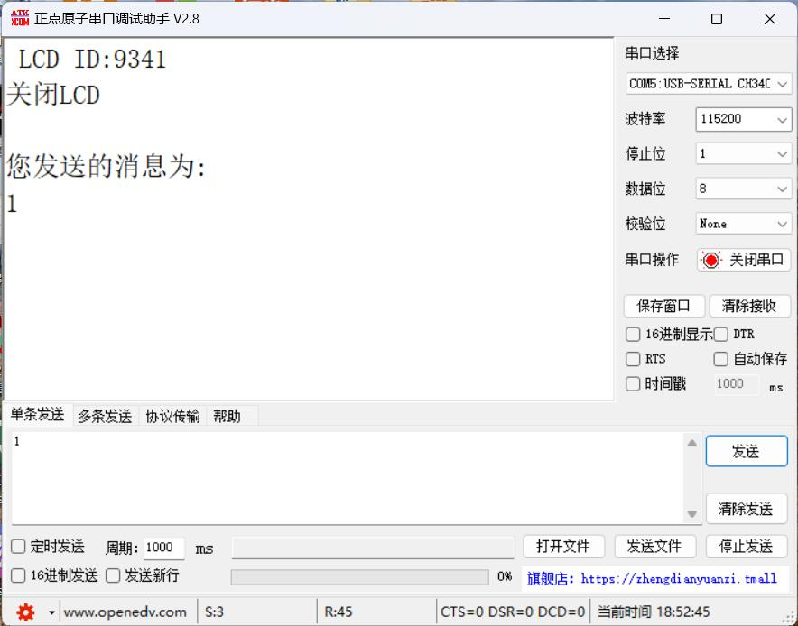


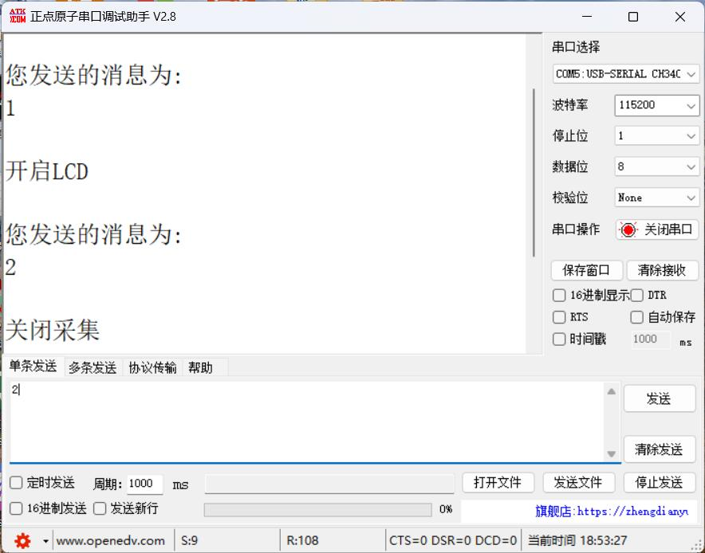


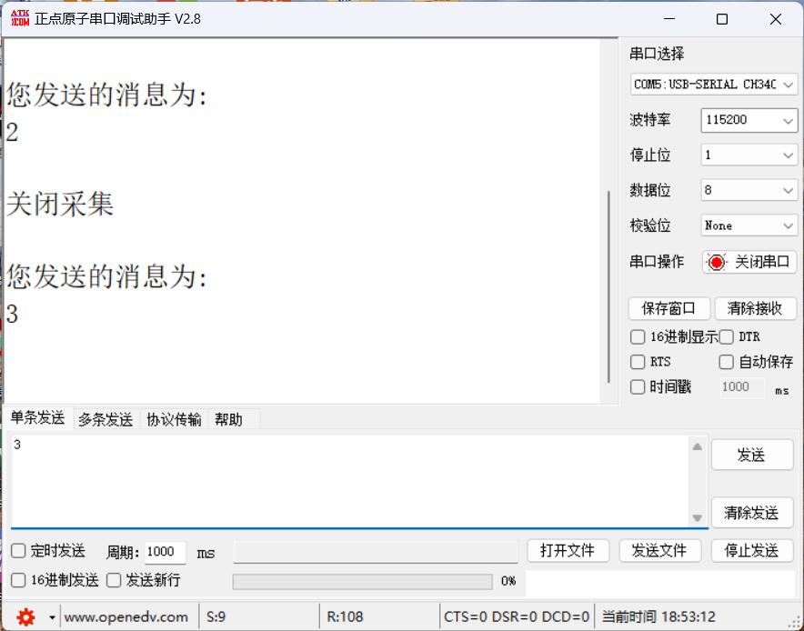


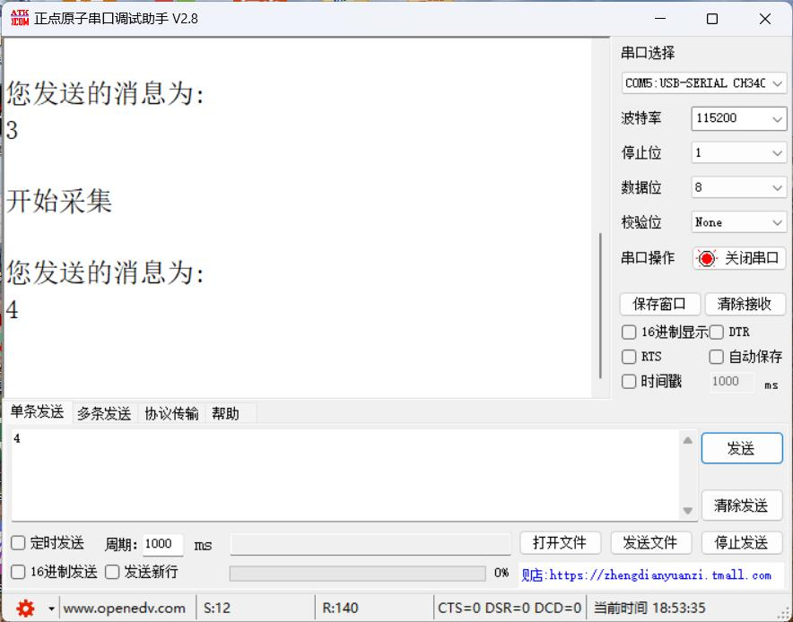

​												图8 上位机发送不同消息

当上位机发送消息为“1”时，MCU执行关闭LCD显示的功能。

当上位机发送消息为“2”时，MCU执行开启LCD显示的功能。

当上位机发送消息为“3”时，MCU执行关闭采集的功能。

当上位机发送消息为“4”时，MCU执行开启采集的功能。

（3）根据当前环境参数调整PWM占空比；

本设计利用采集到的光照强度修改PWM的占空比，为了达到更好的显示效果，将定时器14的自动重装载值（ARR寄存器的值）设置为100，预分频系数（PSC寄存器的值）设置为420，最终得到PWM的频率为2kHz。

例如：

当光照强度为20时，PWM占空比则为20%（20 / 100 * 100% = 20%）

当光照强度为50时，PWM占空比则为50%（50 / 100 * 100% = 50%）

当光照强度为70时，PWM占空比则为70%（70 / 100 * 100% = 70%）

当光照强度为90时，PWM占空比则为90%（90 / 100 * 100% = 90%）

当光照强度为100时，PWM占空比则为100%（100 / 100 * 100% = 100%）

使用LED1显示PWM在不同占空比下的效果。

6.附加功能

（1）触摸功能

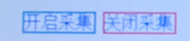

​													图9 触摸功能

如图9所示，在LCD特定位置设置触摸检测。

当触摸“开启采集”部分时，MCU发出开启采集命令，内部温度传感器和光照强度传感器开始进行采集，并将结果输出至LCD屏幕上。

当触摸“关闭采集”部分时，MCU发出关闭采集命令，内部温度传感器和光照强度传感器被关闭，停止采集，并在LCD上显示“OFF”字样，如图10所示。

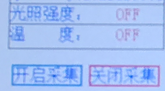

​										图10 触摸关闭采集时，LCD显示“OFF”

（2）   图片显示并切换功能

在task5任务中读取对图片取模后存储在数组中的数据，然后再LCD上进行显示，同时，关闭采集功能。


​										图11 显示美国前总统特朗普演讲照片

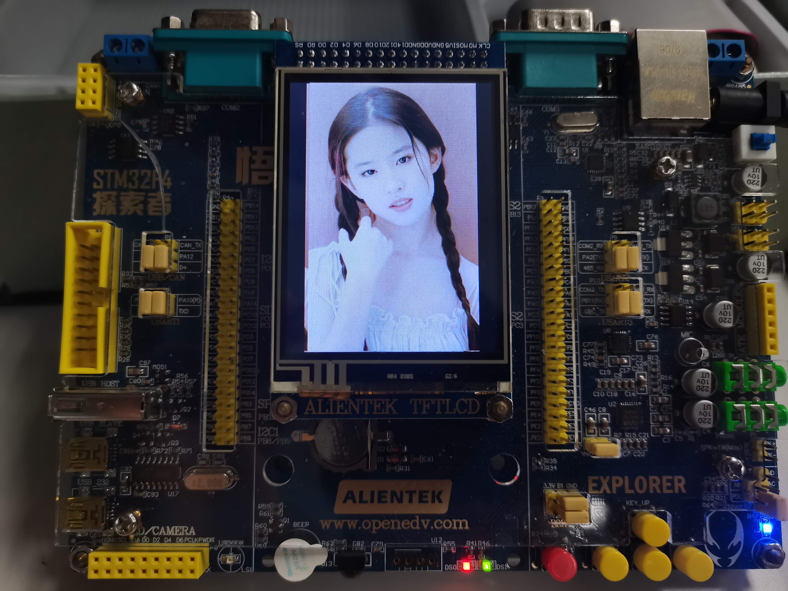

​											图12 显示中国女明星刘亦菲照片

当KEY0按键被按下时，实现切换图片功能，如图12所示，当KEY0被按下时，照片从美国前总统特朗普演讲照片切换为中国女明星刘亦菲照片。

 当KEY1按键被按下时，关闭图片显示功能，开启采集功能。

## 五、更新README.md所需代码

```
git add README.md
git commit -m "修改内容"
git push origin main
```

